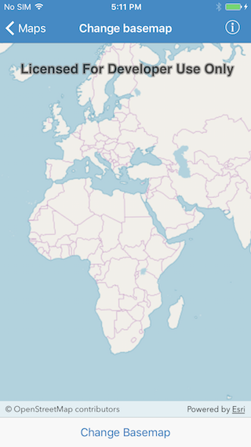

<!--
# Change basemap
-->
# ベースマップの変更

<!--
This sample demonstrates how to change basemap of a map.
-->
マップのベースマップを変更する方法を説明します。

<!--
## How to use the sample
-->
## サンプルの使用方法

<!--The sample provides a switch in the bottom toolbar, you can use to change the basemap of the map
-->
ツールバーのボタンを選択して、マップのベースマップを変更します。

<!--
## How it works
-->
## コードの実装方法

<!--
`AGSMap` has a `basemap` property of type `AGSBasemap`. On each selection, the app creates a new basemap of the specified type and assigns it to `map.basemap`. `AGSBasemap` provides a set of factory methods for each of Esri's basemap.
-->
`AGSMap` は `AGSBasemap` タイプの `basemap` プロパティを持っています。ボタンを選択すると、 特定のタイプの新しいベースマップを作成して、`map.basemap` にアサインします。`AGSBasemap` には Esri の各ベースマップ用のファクトリ メソッドのセットが用意されています。
